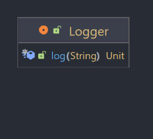
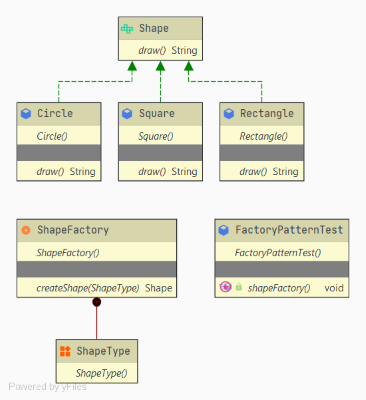
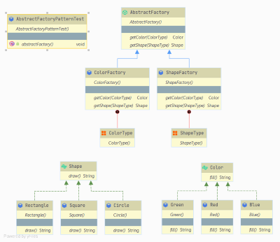
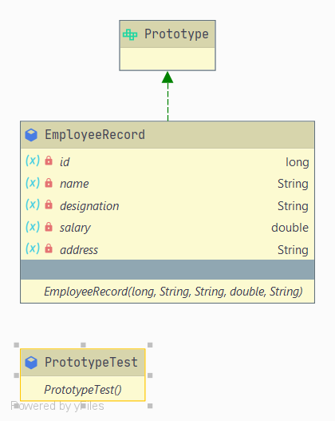
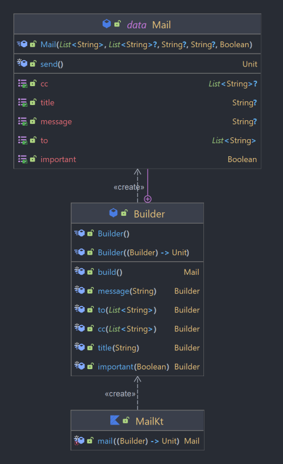
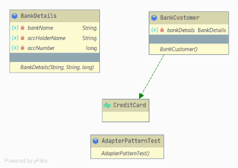
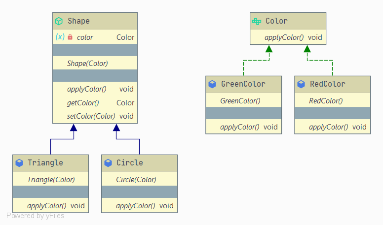

# Kotlin Design Patterns


## What is Design Patterns ?

Design Patterns are a proven way to solve common programming problems.
These issues or questions will usually arise during the software development period for programmers.
Pattern design solutions are typically using object-oriented.

## Advantage of design pattern

1. They are reusable in multiple projects.
2. They provide the solutions that help to define the system architecture.
3. They capture the software engineering experiences.
4. They provide transparency to the design of an application.
5. They are well-proved and testified solutions since they have been built upon the knowledge and experience of expert
   software developers.

## Type of design pattern

### [Creational Design Pattern](https://github.com/ghasemdev/kotlin-design-patterns#creational-design-pattern-1)

1. [Singleton Pattern](#singleton-pattern)
2. [Factory Pattern](#factory-pattern)
3. [Abstract Factory Pattern](#abstract-factory-pattern)
4. [Prototype Pattern](#prototype-pattern)
5. [Builder Pattern](#builder-pattern)

### [Structural Design Pattern](https://github.com/ghasemdev/kotlin-design-patterns#structural-design-pattern-1)

6. [Adapter Pattern](#adapter-pattern)
7. [Bridge Pattern](#bridge-pattern)
8. [Composite Pattern](#composite-pattern)
9. [Decorator Pattern](#decorator-pattern)
10. [Facade Pattern](#facade-pattern)
11. [Flyweight Pattern](#flyweight-pattern)
12. [Proxy Pattern](#proxy-pattern)

### [Behavioral Design Pattern](https://github.com/ghasemdev/kotlin-design-patterns#behavioral-design-pattern-1)

13. [Chain Of Responsibility Pattern](#chain-of-responsibility-pattern)
14. [Command Pattern](#command-pattern)
15. [Interpreter Pattern](#interpreter-pattern)
16. [Iterator Pattern](#iterator-pattern)
17. [Mediator Pattern](#mediator-pattern)
18. [Memento Pattern](#memento-pattern)
19. [Observer Pattern](#observer-pattern)
20. [State Pattern](#state-pattern)
21. [Strategy Pattern](#strategy-pattern)
22. [Template Pattern](#template-pattern)
23. [Visitor Pattern](#visitor-pattern)

# Creational Design Pattern

One of the sub-branches of Pattern Design is Creational Design Pattern. This pattern is a way to make things.
This template is used when we want to create an object from a class in our program.
But for many it may be very easy to build an object and just by new we create an object.
But hard code is not a good solution Because we sometimes change the identity of a class in our code, and in such cases
we have to use the Creational Design pattern.

## Singleton Pattern

[The singleton pattern](src/main/creational/singleton) ensures that only one object of a particular class is ever
created. All further references to object of the singleton class refer to the same underlying instance.



**Example**

```kotlin
object Logger {
    init {
        println("$this I was accessed for the first time")
    }

    fun log(massage: String) = println("$this massage = $massage")
}
```

**Usage**

```kotlin
Logger.log("Hello World")
Logger.log("Hello Kotlin")
```

**Output**

```
singleton.Logger@12f41634 I was accessed for the first time
singleton.Logger@12f41634 massage = Hello World
singleton.Logger@12f41634 massage = Hello Kotlin
```

## Factory Pattern

[The factory pattern](src/main/creational/factory) is used to replace class constructors,
abstracting the process of object generation so that the type of the object instantiated can be determined at run-time.
we can also use sealed class.



**Example**

```kotlin
interface ChessPiece {
    val file: Char
    val rank: Char
}

data class Pawn(
    override val file: Char,
    override val rank: Char
) : ChessPiece

data class Queen(
    override val file: Char,
    override val rank: Char
) : ChessPiece

class UnknownPiece(message: String) : RuntimeException(message)

object ChessFactory { // Factory create chess piece
    fun createPiece(notation: String): ChessPiece {
        val (type, file, rank) = notation.toCharArray()
        return when (type) {
            'p' -> Pawn(file, rank)
            'q' -> Queen(file, rank)
            else -> throw UnknownPiece(type.toString())
        }
    }
}
```

**Usage**

```kotlin
val notations = listOf("pa8", "qc3")
val pieces = mutableListOf<ChessPiece>()
for (n in notations) {
    pieces.add(ChessFactory.createPiece(n))
}
println(pieces)
```

**Output**

```
[Pawn(file=a, rank=8), Queen(file=c, rank=3)]
```

## Abstract Factory Pattern

[The abstract factory pattern](src/main/creational/abstractfactory) is used to provide a client with a set of related
or dependant objects. The "family" of objects created by the factory are determined at run-time.



**Example**

```kotlin
interface Property {
    val name: String
    val value: Any
}

data class IntProperty(
    override val name: String,
    override val value: Int
) : Property

data class StringProperty(
    override val name: String,
    override val value: String
) : Property

interface ServerConfiguration {
    val properties: List<Property>
}

data class ServerConfigurationImpl(
    override val properties: List<Property>
) : ServerConfiguration

typealias UnknownPropertyException = RuntimeException

abstract class Parser {
    abstract fun from(file: File): ServerConfiguration

    private fun property(prop: String): Property {
        val (name, value) = prop.split(":")

        return when (name) {
            "port" -> IntProperty(name, value.trim().toInt())
            "environment" -> StringProperty(name, value.trim())
            else -> throw UnknownPropertyException("Unknown property:$name")
        }
    }

    protected fun server(propertyStrings: List<String>): ServerConfiguration {
        val parsedProperties = mutableListOf<Property>()
        for (p in propertyStrings) {
            parsedProperties += property(p)
        }
        return ServerConfigurationImpl(parsedProperties)
    }
}

object YamlParser : Parser() {
    override fun from(file: File): ServerConfiguration {
        val propertyStrings = file.readLines().drop(1).map { it.trim() }
        return server(propertyStrings)
    }
}

object JsonParser : Parser() {
    override fun from(file: File): ServerConfiguration {
        val regex = """(\s|\{|}|"|,)*""".toRegex()
        val lines = file.readLines()
        val propertyStrings = lines.map { it.replace(regex, EMPTY) }.subList(2, lines.lastIndex - 1)
        return server(propertyStrings)
    }

    private const val EMPTY = ""
}
```

**Usage**

```yaml
server:
  port: 8080
  environment: production
```

```json
{
  "server": {
    "port": 8080,
    "environment": "production"
  }
}
```

```kotlin
val ymlPath = "configure.yml"
println(YamlParser.from(File(path)))

val jsonPath = "configure.json"
println(JsonParser.from(File(path)))
```

**Output**

```
ServerConfigurationImpl(properties=[IntProperty(name=port, value=8080), StringProperty(name=environment, value=production)])
ServerConfigurationImpl(properties=[IntProperty(name=port, value=8080), StringProperty(name=environment, value=production)])
```

## Prototype Pattern

The purpose of a [pattern prototype](src/main/creational/prototype) is that we do not create different objects of the
same class, simplify an object we have, and do not pay to build a new object.
we can also implement Cloneable class or use `my_object.copy()` in Kotlin.



**Example**

```kotlin
interface Prototype {
    fun getClone(): Prototype
}

data class EmployeeRecord(
    var id: Long,
    var name: String,
    var designation: String, var salary: Double,
    var address: String
) : Prototype {
    override fun getClone(): Prototype {
        return EmployeeRecord(id, name, designation, salary, address)
    }
}
```

**Usage**

```kotlin
val e1 = EmployeeRecord(7072, "jack", "software engineer", 1000.0, "Tehran Iran")
println(e1)
val e2 = e1.getClone()
println(e2)
```

**Output**

```
EmployeeRecord(id = 7072, name = jack, designation = software engineer, salary = 1000.0, address = Tehran Iran)
EmployeeRecord(id = 7072, name = jack, designation = software engineer, salary = 1000.0, address = Tehran Iran)
```

## Builder Pattern

[The builder pattern](src/main/creational/builder) is used to create complex objects with constituent parts that must be
created in the same order or using a specific algorithm. An external class controls the construction algorithm.



**Example**

```kotlin
class Dialog {

    fun showTitle() = println("showing title")

    fun setTitle(text: String) = println("setting title text $text")

    fun setTitleColor(color: Color) = println("setting title color ${colorToHex(color)}")

    fun showMessage() = println("showing message")

    fun setMessage(text: String) = println("setting message $text")

    fun setMessageColor(color: Color) = println("setting message color ${colorToHex(color)}")

    fun showImage(bitmapBytes: ByteArray) = println("showing image with size ${bitmapBytes.size}")

    fun show() = println("showing dialog $this")

    private fun colorToHex(color: Color) = String.format("#%02x%02x%02x", color.red, color.green, color.blue)

    class Builder(initialize: Builder.() -> Unit) {
        init {
            initialize()
        }

        private var titleHolder: TextView? = null
        private var messageHolder: TextView? = null
        private var imageHolder: File? = null

        fun title(initialize: TextView.() -> Unit) {
            titleHolder = TextView().apply { initialize() }
        }

        fun message(initialize: TextView.() -> Unit) {
            messageHolder = TextView().apply { initialize() }
        }

        fun image(initialize: () -> File) {
            imageHolder = initialize()
        }

        fun build(): Dialog {
            return Dialog().apply {
                titleHolder?.apply {
                    setTitle(text)
                    setTitleColor(color)
                    showTitle()
                }

                messageHolder?.apply {
                    setMessage(text)
                    setMessageColor(color)
                    showMessage()
                }

                imageHolder?.apply {
                    showImage(readBytes())
                }
            }
        }

        class TextView {
            var text: String = ""
            var color: Color = Color.BLACK
        }
    }
}
```

**Usage**

```kotlin
val dialog = Dialog.Builder {
    title {
        text = "Dialog Title"
    }
    message {
        text = "Dialog Message"
        color = Color.RED
    }
    image {
        File.createTempFile("image", "jpg")
    }
}.build()

dialog.show()
```

**Output**

```
setting title text Dialog Title
setting title color #000000
showing title
setting message Dialog Message
setting message color #ff0000
showing message
showing image with size 0
showing dialog builder.Dialog@9660f4e
```

# Structural Design Pattern

Structural Patterns talk about objects and classes and how they combine.
This pattern creates a simple structure to indicate the relationship of objects and classes to each other.

## Adapter Pattern

[The adapter pattern](src/main/structural/adapter) is used to provide a link between two otherwise incompatible types
by wrapping the "adapter" with a class that supports the interface required by the client.



**Example**

```kotlin
data class BankDetails(var bankName: String, var accHolderName: String, var accNumber: Long)

interface CreditCard {
    fun generateBankDetails(bankName: String, accHolderName: String, accNumber: Long)
    fun getCreditCard(): String
}

class BankCustomer : CreditCard {
    private lateinit var bankDetails: BankDetails

    override fun generateBankDetails(bankName: String, accHolderName: String, accNumber: Long) {
        bankDetails = BankDetails(
            bankName,
            accHolderName,
            accNumber
        )
    }

    override fun getCreditCard(): String {
        return "The Account number ${bankDetails.accNumber} of ${bankDetails.accHolderName} " +
                "in ${bankDetails.bankName} bank is valid and authenticated for issuing the credit card."
    }
}
```

**Usage**

```kotlin
val credit: CreditCard = BankCustomer()
credit.generateBankDetails("CG", "Jakode", 2024)
println(credit.getCreditCard())
```

**Output**

```
The Account number 2024 of Jakode in CG bank is valid and authenticated for issuing the credit card.
```

## Bridge Pattern

When we need to make a distinction between abstraction and implementation, we
use [Bridge Pattern](src/main/structural/bridge). The reason for naming this pattern is that an interface is used as a
bridge, which separates between abstraction and implementation.



**Example**

```kotlin
interface Color {
    fun applyColor()
}

abstract class Shape(protected var color: Color /*implementor*/) {
    abstract fun applyColor()
}

class RedColor : Color {
    override fun applyColor() {
        println("red.")
    }
}

class GreenColor : Color {
    override fun applyColor() {
        println("green.")
    }
}

class Circle(color: Color) : Shape(color) {
    override fun applyColor() {
        print("Circle filled with color ")
        color.applyColor()
    }
}

class Triangle(color: Color) : Shape(color) {
    override fun applyColor() {
        print("Triangle filled with color ")
        color.applyColor()
    }
}
```

**Usage**

```kotlin
val redTriangle: Shape = Triangle(RedColor())
redTriangle.applyColor()

val greenTriangle: Shape = Triangle(GreenColor())
greenTriangle.applyColor()

val redCircle: Shape = Circle(RedColor())
redCircle.applyColor()

val greenCircle: Shape = Circle(GreenColor())
greenCircle.applyColor()
```

**Output**

```
Triangle filled with color red.
Triangle filled with color green.
Circle filled with color red.
Circle filled with color green.
```

## Composite Pattern

[The Composite pattern](src/main/structural/composite) helps us to have objects hierarchically,
or in other words, a tree structure.


**Example**

```kotlin
interface Employee {
    fun showEmployeeDetails()
}

class Developer(private var name: String, private var employeeId: Long, var position: String) : Employee {
    override fun showEmployeeDetails() {
        println("$employeeId $name")
    }
}

class Manager(private var name: String, private var employeeId: Long, var position: String) : Employee {
    override fun showEmployeeDetails() {
        println("$employeeId $name")
    }
}

class Company : Employee {
    private val employeeList: MutableList<Employee> = ArrayList()

    override fun showEmployeeDetails() {
        employeeList.forEach { it.showEmployeeDetails() }
    }

    fun addEmployee(employee: Employee) {
        employeeList.add(employee)
    }

    fun removeEmployee(employee: Employee) {
        employeeList.remove(employee)
    }
}
```

**Usage**

```kotlin
val engDirectory = Company()
val developer = Developer("jack", 100, "Developer")
engDirectory.addEmployee(developer)

val accDirectory = Company()
val manager = Manager("elias", 200, "Sr Manager")
accDirectory.addEmployee(manager)

val directory = Company()
directory.addEmployee(engDirectory)
directory.addEmployee(accDirectory)
directory.showEmployeeDetails()
```

**Output**

```
100 jack
200 elias
```

## Decorator Pattern

## Facade Pattern

## Flyweight Pattern

## Proxy Pattern

# Behavioral Design Pattern

## Chain Of Responsibility Pattern

## Command Pattern

## Interpreter Pattern

## Iterator Pattern

## Mediator Pattern

## Memento Pattern

## Observer Pattern

## State Pattern

## Strategy Pattern

## Template Pattern

## Visitor Pattern
